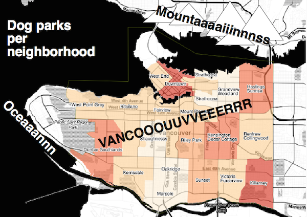

Thanks to all of you who came out to our first MaptimeYVR meeting of the year, and a special thanks to Christian Hill who kicked it all off with a stellar workshop on the open source desktop [QGIS](http://www.qgis.org/en/site/). Christian has made his slides [available for download](../downloads/MaptimeQGIS.pdf), so be sure to check them out. It was great seeing so many faces, and hearing about your different interests.

Thanks also to the [BC Libraries Coop](https://bc.libraries.coop) for providing us with space where all the good things happened.

We are in the works of developing a plan for future meets, with a mix of project time and workshops, so stay tuned!
